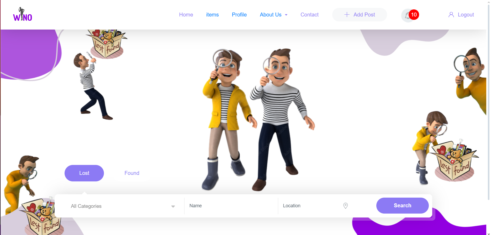

# Lost and Found# Lost and Found 🕵️‍♂️✨

## Description

Lost and Found est une application conçue pour aider les utilisateurs à signaler et retrouver des objets perdus. Que ce soit un porte-monnaie, un téléphone ou un animal de compagnie, cette plateforme permet de centraliser les annonces de perte et de trouvaille.

## Fonctionnalités

- **Signalement d'objets perdus** 🧳 : Les utilisateurs peuvent créer des annonces pour signaler des objets qu'ils ont perdus.
- **Annonce d'objets trouvés** 🐾 : Les utilisateurs peuvent également publier des annonces pour des objets qu'ils ont trouvés.
- **Recherche d'objets** 🔍 : Les utilisateurs peuvent rechercher des objets perdus ou trouvés par catégorie, localisation ou date.
- **Notifications** 🔔 : Recevez des alertes lorsque des objets correspondant à vos critères sont signalés.

## Screenshots

Voici quelques captures d'écran de l'application :


*Page d'accueil de l'application*


*Page d'inscription*


*Interface de contact*

## Technologies utilisées

- **Frontend** : React.js, EJS
- **Backend** : Node.js avec Express
- **Base de données** : MongoDB
- **Authentification** : JWT pour la gestion des sessions 🔑

## Installation

1. Clonez le dépôt :
   ```bash
   git clone https://github.com/votre-utilisateur/lost-and-found.git

